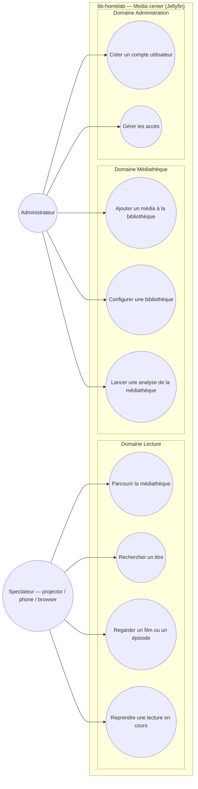

# Use case diagram — jellyfin — media center (who wants what)

> **Feature**: issue #12 — deploy Jellyfin media server
> **Related ADRs**: ADR 0003 (Jellyfin choice + Direct-Play), ADR 0002 (Caddy)
> **Decisions captured**: open-source/local-only media center; viewer vs
> admin goals

## Context

This diagram answers *"who interacts with the media center, and to do
what?"*. It is the contract the deployment must satisfy. Use cases are
grouped by **domain** (Playback, Library, Administration), never by
backend — the Jellyfin / Caddy / storage decomposition lives in
`03-component.md`.

It does **not** describe how anything runs, nor timing (see the
component and sequence diagrams).

## Diagram

## Notes

- **Actor-initiated goals only.** *"Reprendre une lecture"* is the
  Spectateur tapping resume — not a passive *"être notifié de la
  reprise"*. No system-initiated event appears as a use case.
- **Administrateur is also a Spectateur** in practice (single household
  owner). The actors are kept separate to show that library/account
  management is a distinct goal set, not a privilege every viewer holds.
- **Grouped by domain, not by backend.** Whether a goal is served by
  Jellyfin, Caddy, or the storage layer is irrelevant here — that split
  is in `03-component.md`.
- Out of scope as a use case: *transcoding* (an internal mechanism, not
  an actor goal) — its decision is captured in ADR 0003 and visualised
  in `02-watch-film.md`.
