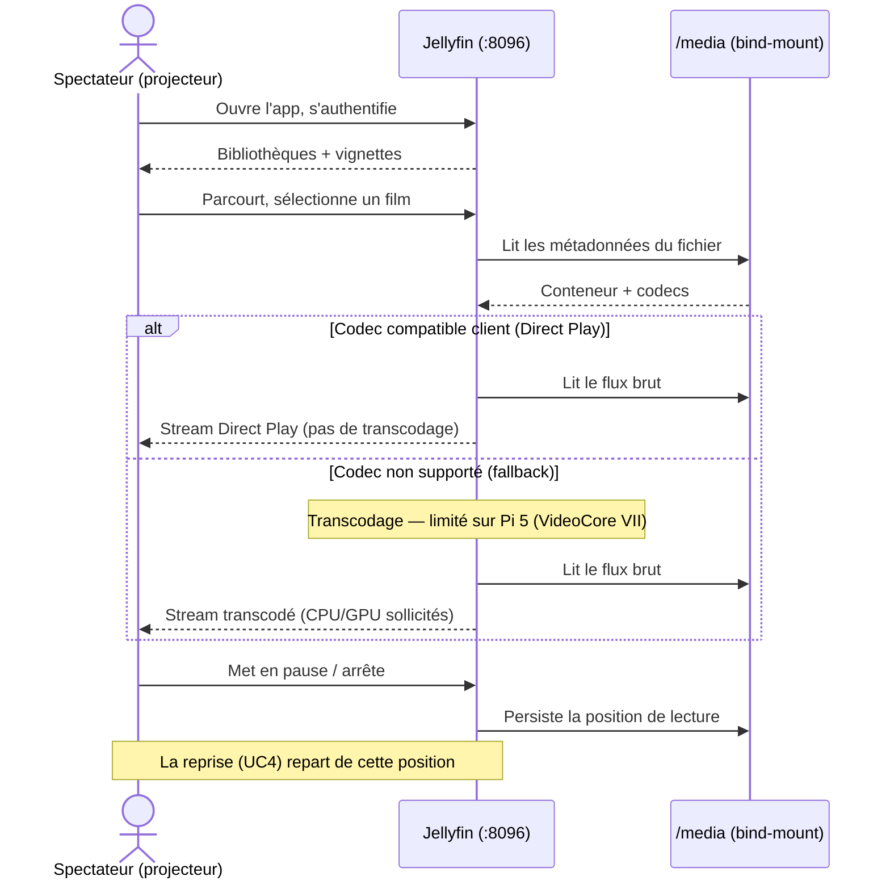

# Sequence diagram — jellyfin — watch a film from the projector

> **Feature**: issue #12 — deploy Jellyfin media server
> **Related ADRs**: ADR 0003 (Direct-Play-first on the Pi 5)
> **Decisions captured**: Direct Play when codec-compatible, transcode
> only as fallback

## Context

This diagram shows what happens *in time* during the most common
scenario: a viewer starts a film from the Android TV projector. Its
purpose is to make the **Direct-Play-first** decision (ADR 0003)
visible as a branch — Direct Play is the happy path; transcoding is the
costly fallback the Pi 5's GPU only partially supports.

It does **not** cover authentication setup, library scanning, or the
admin flows (see `01-use-case.md`).

## Diagram

## Notes

- **The `alt` block is the whole point.** ADR 0003 chooses
  Direct-Play-first precisely to keep playback in the top branch: store
  media in formats the projector decodes natively (H.264/AAC baseline)
  so the Pi never enters the costly transcode branch.
- **Transcoding is a fallback, not a feature.** Drawn to make its cost
  explicit, not to encourage relying on it — the Pi 5 GPU only partially
  hardware-transcodes, so the bottom branch can saturate the CPU.
- **No third party in the diagram.** The flow is entirely
  Spectateur ↔ Pi ↔ disk — consistent with the no-egress structure in
  `03-component.md`. Watch position is persisted locally to `/config`
  (via Jellyfin), enabling the *Reprendre une lecture* use case.
- The access path (LAN `:8096` / tailnet / Caddy) is abstracted here as
  a direct `S → J` edge; the three concrete paths are in
  `03-component.md`.
