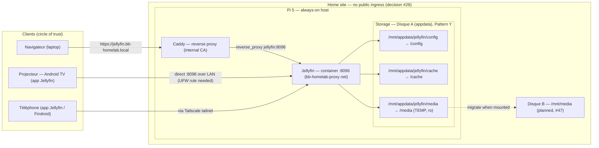

# Component diagram — jellyfin — structure & access paths

> **Feature**: issue #12 — deploy Jellyfin media server
> **Related ADRs**: ADR 0003 (Jellyfin + storage), ADR 0002 (Caddy),
> ADR 0001 (DIP layering)
> **Decisions captured**: access via LAN / tailnet / Caddy; library
> temporarily on appdata; no off-site egress

## Context

This diagram shows the **structural boundaries**: which component runs
where, the three ways a client reaches Jellyfin, and the storage
bind-mounts. It deliberately makes the **egress** explicit — and the
point is that *there is none*: no media, account, or watch history ever
leaves the home site (the open-source / local-first stance behind the
Jellyfin choice, ADR 0003).

It does **not** cover timing (see `02-watch-film.md`) nor the firewall
rule mechanics (a deploy-time concern documented in
`services/jellyfin/README.md`).

## Diagram

## Notes

- **No off-site egress.** Unlike the monitoring stack (which has a
  heartbeat to Healthchecks.io), Jellyfin has *zero* outbound path:
  media, accounts and watch history stay on the Pi. This is the
  concrete payoff of the all-open-source / no-cloud choice (ADR 0003).
- **Three access paths, one server.** Direct `:8096` for LAN devices
  (the projector — requires a UFW rule opening 8096 to the LAN subnet);
  the tailnet for remote devices; Caddy's hostname for browsers that
  trust the internal CA. All converge on the same container.
- **Storage egress point is the `media` bind-mount.** Today it is a
  temporary read-only directory on the `appdata` disk; the dashed edge
  to `Disque B` is the planned migration to `/mnt/media` when the disk
  lands (#47). `create_host_path: false` guarantees the container
  refuses to start rather than silently writing to the SD card.
- Anti-pattern this makes visible: publishing `:8096` without a UFW
  rule would leave the projector unable to reach it (UFW defaults to
  port 22 only) — the access path must be opened deliberately, per
  source subnet, not blanket-opened.
