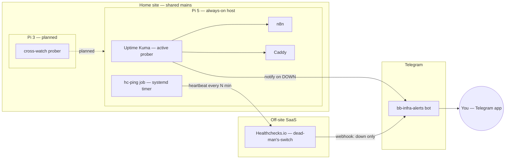

# Component diagram — monitoring — layered active + passive

> **Feature**: issue #44 — monitoring Stack B
> **Related ADRs**: ADR 0004 (monitoring architecture), ADR 0002 (Caddy)
> **Decisions captured**: the 3 monitoring layers + single alert channel

## Context

This diagram shows the **structural boundaries** of the monitoring
setup: which component runs where, and the dependencies between them.
It deliberately makes the **egress points** explicit — the only paths
that leave the home site are the heartbeat to Healthchecks.io and the
Telegram alerts.

It does **not** cover timing/ordering (see `06-data-flow.md` for what
flows) nor the decommissioned laptop watchers (`wan-monitor`,
`n8n-watchdog`) which are removed per ADR 0004.

## Diagram

## Notes

- **Single egress for the dead-man's-switch**: only `hc-ping job → hc`
  leaves the site as an outbound heartbeat. If the Pi, mains, or WAN
  dies, that heartbeat stops and Healthchecks.io alerts from off-site —
  the whole point of layer 2 (ADR 0004).
- **Single alert sink**: every layer converges on one `bb-infra-alerts`
  bot. No layer talks to the user directly by another channel.
- **Pi 3 is dashed/planned**: it watches the Pi 5 for *isolated*
  failures only; same-mains means a power cut is common-cause and is
  covered by layer 2, not by the cross-watch.
- **Decommissioned** (not drawn): laptop `wan-monitor` and
  `n8n-watchdog` — laptop sleep made their signal misleading.
- Anti-pattern this makes visible: hosting Healthchecks.io *inside*
  `home` would create a same-box egress with no off-site observer — the
  watcher paradox.
