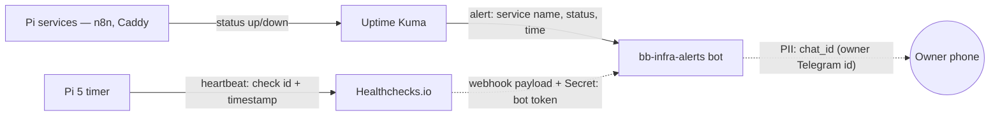

# Data-flow diagram — monitoring — what flows and what is sensitive

> **Feature**: issue #44 — monitoring Stack B
> **Related ADRs**: ADR 0004 (monitoring architecture)
> **Decisions captured**: fault-only alerting + single bot channel

## Context

This diagram tracks **what data moves where** across the monitoring
layers, and flags the **sensitive edges** so a privacy/secret review
cannot be skipped. The data is operational (status, timestamps, check
names) — there is no service *content* and no end-user PII in the
monitored payloads. The two sensitive edges are the **bot token** (a
secret) and the **destination chat id** (the owner's Telegram id).

It does **not** cover component boundaries (see `03-component.md`).

## Diagram

## Notes

- **Fault-only**: edges into `bot` only fire on a *down* transition
  (Healthchecks.io webhook configured for the down event; Uptime Kuma
  on DOWN). No "recovered" / heartbeat messages by design — "no news is
  good news" (ADR 0004).
- **Secret edge** (`hc -.-> bot`): the webhook URL embeds the Telegram
  **bot token**. It lives in the Healthchecks.io integration config and
  the password manager — never in git. Rotating it = re-issue via
  BotFather + update the webhook.
- **PII edge** (`bot -.-> phone`): the only quasi-personal datum is the
  destination `chat_id` (the owner's Telegram id). No other PII transits.
- **What does NOT flow off-site**: service contents, logs, n8n data —
  none of it. Healthchecks.io receives a bare ping; Telegram receives a
  short status string. Minimal-disclosure by construction.
